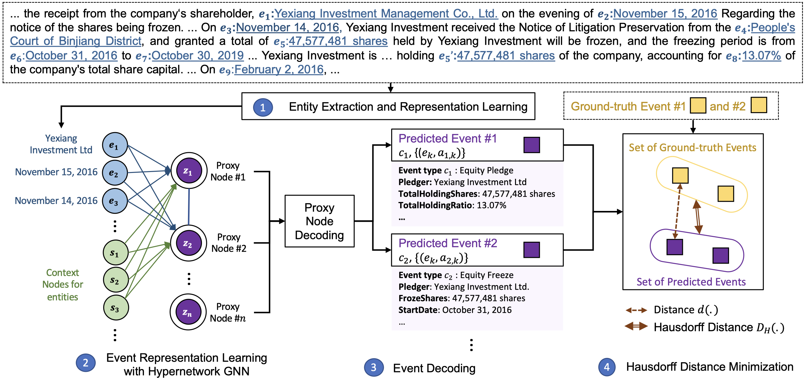

# Document-Level Multi-Event Extraction with Event Proxy Nodes and Hausdorff Distance Minimization

Code for the paper: 
["Document-Level Multi-Event Extraction with Event Proxy Nodes and Hausdorff Distance Minimization"](https://aclanthology.org/2023.acl-long.563.pdf)

## Introduction

> Document-level multi-event extraction aims to extract the structural information from a given document automatically. Most recent approaches usually involve two steps: (1) modeling entity interactions; (2) decoding entity interactions into events. However, such approaches ignore a global view of inter-dependency of multiple events. Moreover, an event is decoded by iteratively merging its related entities as arguments, which might suffer from error propagation and is computationally inefficient. In this paper, we propose an alternative approach for document-level multi-event extraction with event proxy nodes and Hausdorff distance minimization. The event proxy nodes, representing pseudo-events, are able to build connections with other event proxy nodes, essentially capturing global information. The Hausdorff distance makes it possible to compare the similarity between the set of predicted events and the set of ground-truth events. By directly minimizing Hausdorff distance, the model is trained towards the global optimum directly, which improves performance and reduces training time. Experimental results show that our model outperforms previous state-of-the-art method in F1-score on two datasets with only a fraction of training time.



## Dependency

```
torch
torch-geometric
transformers
numpy
tqdm
```

The metric code `procnet/dee/dee_metric.py` is from [dee_metric.py](https://github.com/dolphin-zs/Doc2EDAG/blob/master/dee/dee_metric.py) of [Doc2EDAG](https://github.com/dolphin-zs/Doc2EDAG).

## Dataset

Please unzip `data.zip` at `Data/` as:

```bash
>> cd Data
>> unzip data.zip
```

After unzipping it, you should see:

```
├─ Data/
    ├── dev.json
    ├── test.json
    ├── train.json
```

`data.zip` is from [Data.zip](https://github.com/dolphin-zs/Doc2EDAG/raw/master/Data.zip) of [Doc2EDAG](https://github.com/dolphin-zs/Doc2EDAG).

## Usage

To train the model:

```bash
>> bash run.sh
```

During training, brief results are printed and detailed results are saved at `Result/` as:

```
├─ Result/
    ├── {name of this run}/
        ├── {name of this run}_001.json
        ├── {name of this run}_002.json
        ...
        ├── {name of this run}_{epoch}.json
        ...
```


## Citation

If our work help you, please cite the paper as follows:

```bib
@inproceedings{wang-etal-2023-document,
    title = "Document-Level Multi-Event Extraction with Event Proxy Nodes and Hausdorff Distance Minimization",
    author = "Wang, Xinyu  and
      Gui, Lin  and
      He, Yulan",
    booktitle = "Proceedings of the 61st Annual Meeting of the Association for Computational Linguistics (Volume 1: Long Papers)",
    month = jul,
    year = "2023",
    address = "Toronto, Canada",
    publisher = "Association for Computational Linguistics",
    url = "https://aclanthology.org/2023.acl-long.563",
    pages = "10118--10133",
}
```
